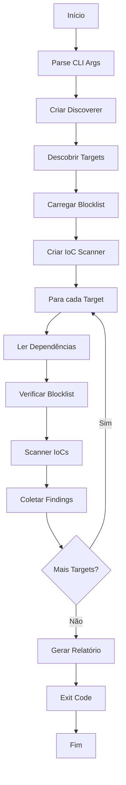

# Arquitetura do npm-malicious-scanner

## 📋 Análise sobre MCP (Model Context Protocol)

### ❌ Este projeto NÃO utiliza protocolo MCP

Este documento esclarece a arquitetura do `npm-malicious-scanner` e explica por que ele não é baseado no protocolo MCP.

## 🔍 Análise da Arquitetura Atual

### 📦 Tecnologia Base
- **Linguagem:** Go (Golang) 1.21.1
- **Framework CLI:** Cobra (github.com/spf13/cobra v1.10.1)
- **Tipo:** Aplicação standalone/binário executável
- **Compilação:** Binário estático sem dependências CGO

### 🏗️ Estrutura do Projeto

```
npm-malicious-scanner/
├── cmd/npm-malicious/main.go    # CLI principal - entry point
├── internal/scanner/            # Lógica interna (pacotes privados)
│   ├── blocklist.go            # Sistema de blocklist para pacotes maliciosos
│   ├── discover.go             # Descoberta de targets (node_modules, package.json)
│   ├── iocscan.go              # Scanner de IoCs (Indicators of Compromise)
│   ├── npmreader.go            # Leitor e parser de package.json
│   ├── reportwriter.go         # Gerador de relatórios (Pretty, JSON)
│   └── types.go                # Definição de tipos de dados
├── bin/npm-malicious           # Binário compilado
├── example-blocklist.json      # Exemplo de blocklist
├── Makefile                    # Build automation
└── README.md                   # Documentação de uso
```

### 🔧 Tipo de Aplicação

Este é um **CLI Tool tradicional** com as seguintes características:

- ✅ **Executável standalone** sem servidor
- ✅ **Interface de linha de comando** com flags
- ✅ **Não possui API** ou protocolo de comunicação
- ✅ **Processamento local** de arquivos
- ✅ **Saída via STDOUT/STDERR**

## ❌ Por que NÃO é MCP?

### O que é MCP (Model Context Protocol)?

**MCP** é um protocolo específico para:
- 🤖 **Comunicação entre LLMs e ferramentas externas**
- 🌐 Baseado em **JSON-RPC** ou **WebSocket**
- 🔌 Requer **servidor MCP** que expõe funcionalidades
- 📡 Interface para **AI agents** acessarem recursos
- 🎯 Permite que modelos de IA usem ferramentas externas

### Comparação: MCP vs npm-malicious-scanner

| Aspecto | MCP Server | npm-malicious-scanner |
|---------|------------|----------------------|
| **Protocolo** | JSON-RPC/WebSocket | CLI flags |
| **Interface** | API para LLMs | Linha de comando |
| **Arquitetura** | Client-Server | Standalone |
| **Uso** | AI agents/assistentes | Usuário direto |
| **Comunicação** | Protocolo MCP | STDOUT/STDERR |
| **Deployment** | Servidor rodando | Execução única |
| **Integração** | Via protocol calls | Via shell commands |

## 🎯 Arquitetura Atual Detalhada

### 1. **CLI Principal** (`cmd/npm-malicious/main.go`)
```go
// Flags disponíveis:
--paths strings      # Caminhos para escanear
--exclude strings    # Padrões regex para excluir
--output string      # Formato de saída (pretty, json)
--blocklist string   # Arquivo de blocklist JSON
```

### 2. **Scanner de Descoberta** (`discover.go`)
- Percorre diretórios recursivamente
- Identifica `node_modules` e `package.json`
- Aplica filtros de exclusão via regex

### 3. **Leitor de Dependências** (`npmreader.go`)
- Parse de arquivos `package.json`
- Extração de metadados (nome, versão, path)
- Estruturação em `PackageRef`

### 4. **Sistema de Blocklist** (`blocklist.go`)
- Carregamento de lista de pacotes maliciosos
- Matching por nome e versão
- Suporte a versões específicas ou todas

### 5. **Scanner de IoCs** (`iocscan.go`)
- Detecção de padrões suspeitos via regex
- Análise de arquivos JavaScript
- Identificação de código malicioso

### 6. **Gerador de Relatórios** (`reportwriter.go`)
- Formato Pretty (colorido, legível)
- Formato JSON (estruturado)
- Categorização de findings

## 🚀 Fluxo de Execução



## 💡 Se Fosse Converter para MCP

Para transformar este projeto em um **MCP Server**, seria necessário:

### 1. **Criar Servidor MCP**
```json
{
  "name": "npm-malicious-scanner",
  "version": "1.0.0",
  "server": {
    "command": "npm-malicious-mcp-server",
    "args": ["--stdio"]
  }
}
```

### 2. **Implementar JSON-RPC Handlers**
```go
// Exemplo de tools que poderiam ser expostas:
- tools/scan_packages
- tools/check_blocklist
- tools/scan_iocs
- resources/blocklist
- resources/scan_results
```

### 3. **Definir Tools no Protocolo MCP**
```json
{
  "tools": [
    {
      "name": "scan_packages",
      "description": "Scan npm packages for malicious content",
      "inputSchema": {
        "type": "object",
        "properties": {
          "paths": {"type": "array"},
          "blocklist": {"type": "string"}
        }
      }
    }
  ]
}
```

### 4. **Implementar Resources**
```go
// Resources que poderiam ser expostas:
- blocklist://malicious-packages
- scan://results/{id}
- findings://summary
```

## 📝 Conclusão

O `npm-malicious-scanner` é uma **ferramenta CLI tradicional** em Go, não um servidor MCP. Ele:

- ✅ **Funciona perfeitamente** como ferramenta standalone
- ✅ **É eficiente** para análise de segurança de pacotes npm
- ✅ **Tem interface simples** via linha de comando
- ✅ **Gera relatórios úteis** em múltiplos formatos

**Não há necessidade de MCP** para este caso de uso, pois:
- O usuário interage diretamente com a ferramenta
- Não há necessidade de integração com LLMs
- A funcionalidade é completa via CLI
- O escopo é específico e bem definido

---

**Data:** 18 de Setembro de 2025  
**Versão:** 1.0  
**Autor:** Análise Técnica do Projeto
